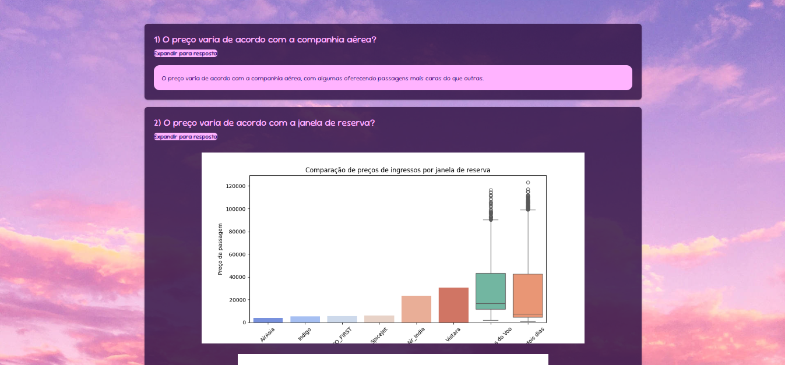

# Flight Price Analysis

Este projeto é uma aplicação web para análise e previsão de preços de passagens aéreas. Através desta aplicação, é possível realizar as seguintes ações:

- **Análise Estatística**: Visualizar gráficos e estatísticas relacionadas aos preços das passagens, como a variação de preço conforme a companhia aérea, a quantidade de dias até a partida, e outras variáveis.
- **Simulação de Preços**: Estimar o preço de passagens com base em dados fornecidos pelo usuário e um modelo de aprendizado de máquina treinado.
- **Upload de Dataset**: Enviar um arquivo CSV contendo informações sobre passagens aéreas para análise, com validação das colunas necessárias.

## Tela de Início

Abaixo está a tela inicial da aplicação onde o usuário pode navegar para diferentes seções:


## Tela de Upload de Dataset

Aqui está a tela onde o usuário pode enviar um arquivo CSV para análise:


## Tela de Estatísticas

A tela de estatísticas exibe os gráficos de análise de preços de passagens:



## Tela Sobre

A tela sobre explica melhor o dataset utilizado e o objetivo do trabalho:


## Tela de Simulação:

Na tela de simulação é possível fazer uma estimativa de preço de passagens de acordo com as variáveis escolhidas:


## Tecnologias Utilizadas

- **Flask**: Framework para desenvolvimento da aplicação web.
- **Pandas**: Manipulação e análise de dados.
- **Seaborn e Matplotlib**: Bibliotecas para visualização de dados.
- **Scikit-learn**: Biblioteca para aprendizado de máquina.
- **XGBoost**: Modelo de aprendizado de máquina para previsão de preços.
- **Joblib**: Para salvar e carregar modelos de aprendizado de máquina.

## Como Rodar o Projeto

1. **Clonar o Repositório**:
   Clone o repositório para o seu ambiente local:
   ```bash
   git clone https://github.com/jennigoberski/flight-price-analysis.git 
   
2. Instalar as Dependências: Para instalar todas as dependências necessárias, use o seguinte comando:
```bash
   pip install pandas seaborn matplotlib flask joblib
   pip install scikit-learn xgboost
